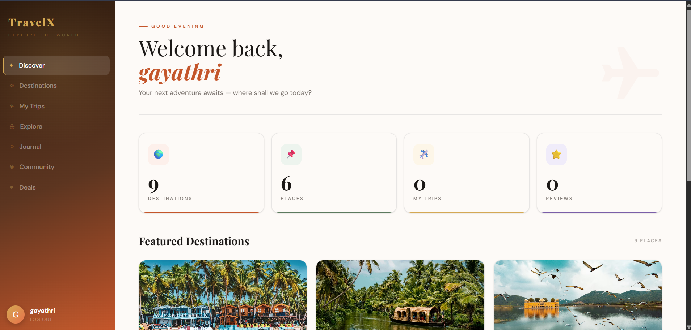
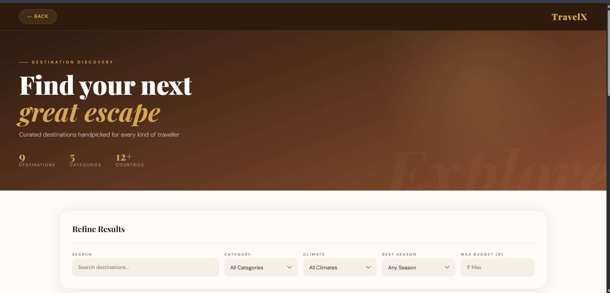
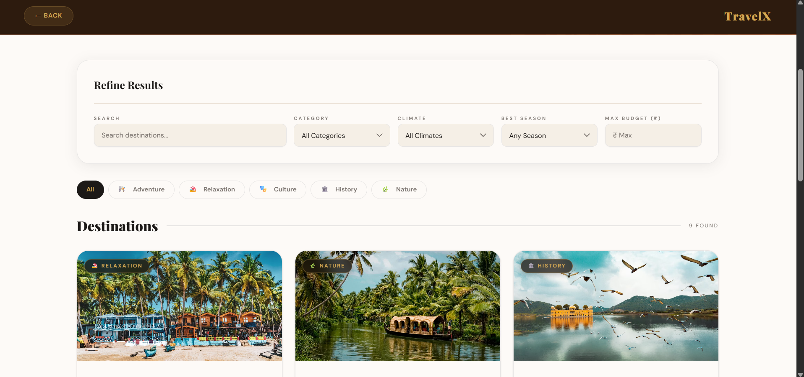
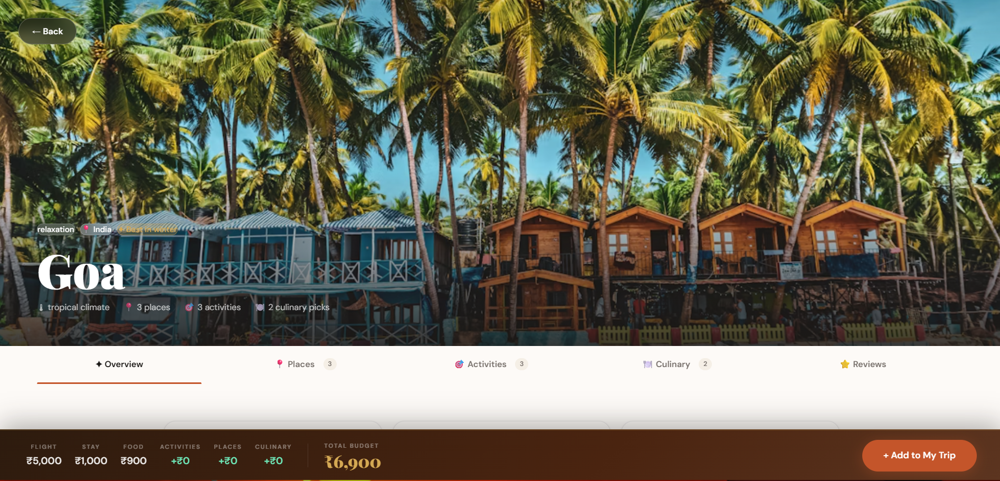
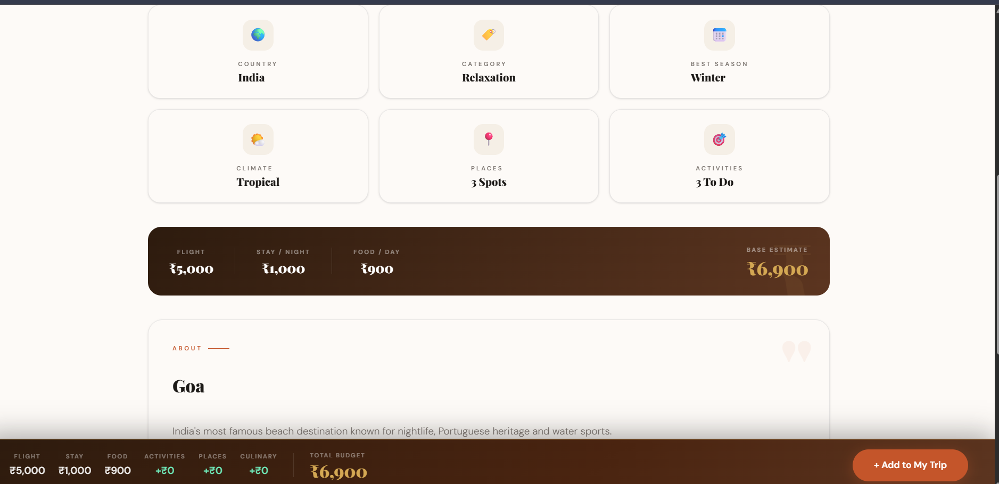
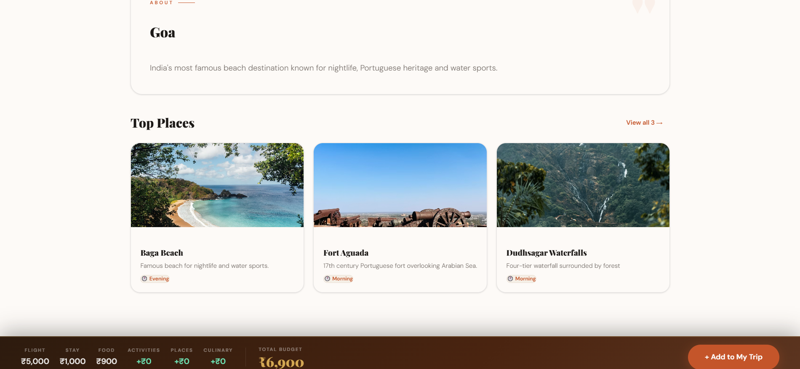
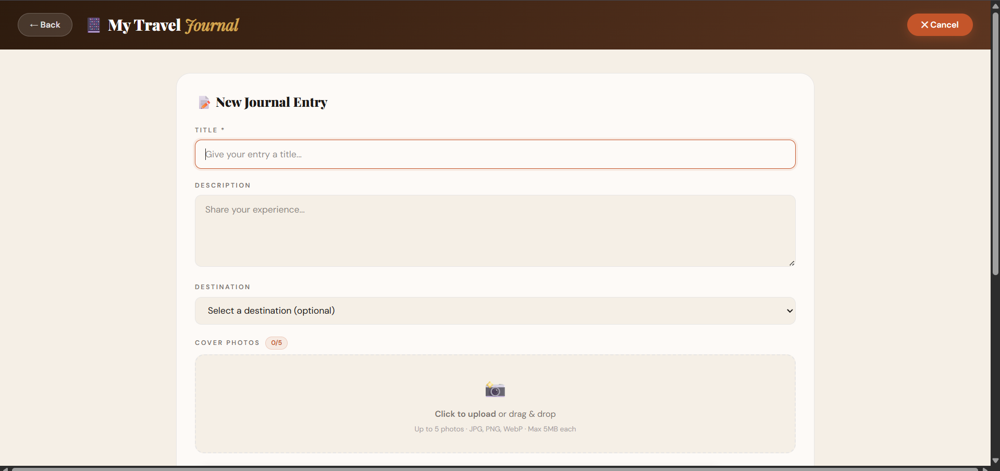
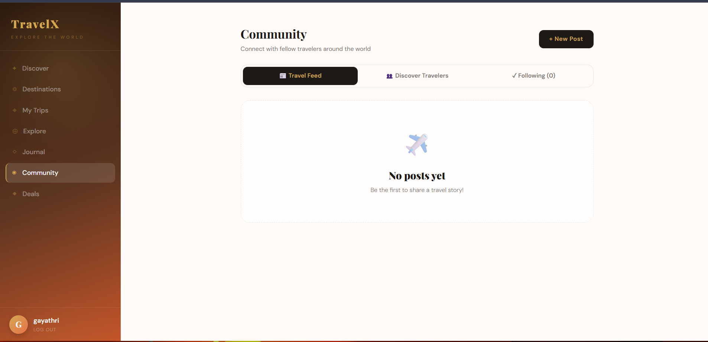
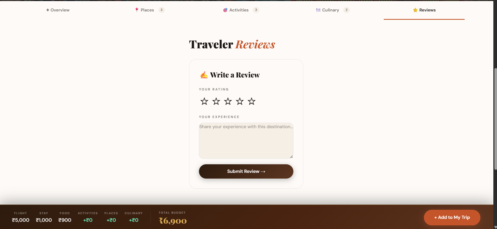

# 🌍 Travel Inspiration Platform — Frontend

> A personalized travel discovery web app that helps users explore destinations, plan trips, manage budgets, and share travel experiences.

---

## 📌 Project Description

Travel Inspiration Platform is a full-stack travel web application built for users like Chloe — passionate travelers who want curated destination suggestions, trip planning tools, budget estimators, travel journals, and a social community to share adventures.

---

## ✨ Features

- 🔐 **User Authentication** — Signup, login, and role-based access (admin/user) via Supabase Auth
- 🗺️ **Destination Explorer** — Browse destinations with filters (category, climate, season)
- 📍 **Places & Activities** — View top spots and activities for each destination
- 🍽️ **Culinary Guide** — Local dishes with descriptions and price estimates per destination
- 💰 **Budget Estimator** — Flight, stay, and food cost breakdowns per destination
- 🗓️ **Trip Planner** — Create multi-destination trips with dates, notes, and budgets
- 📔 **Travel Journal** — Document trips with photos and personal stories
- ⭐ **Reviews & Ratings** — Rate and review destinations (1–5 stars)
- 🤝 **Social Features** — Follow travelers, like/comment on posts, share to social media
- 🎟️ **Exclusive Deals** — Flight, hotel, tour, and package deals with discount highlights
- 🛠️ **Admin Dashboard** — Manage destinations, places, activities, culinary, and deals

---

## 🛠️ Tech Stack

| Layer | Technology |
|-------|-----------|
| Framework | React + Vite |
| Styling | Tailwind CSS, shadcn/ui |
| Auth & DB | Supabase |
| State | React Hooks |
| Routing | React Router v6 |
| HTTP Client | Fetch API |
| Deployment | Netlify |

---

## ⚙️ Installation Steps

```bash
# 1. Clone the repository
git clone <your-frontend-repo-url>
cd travel-inspiration-frontend

# 2. Install dependencies
npm install

# 3. Create environment file
cp .env.example .env
```

Add the following to your `.env` file:

```env
VITE_SUPABASE_URL=your_supabase_project_url
VITE_SUPABASE_ANON_KEY=your_supabase_anon_key
VITE_API_BASE_URL=https://your-backend.onrender.com
```

```bash
# 4. Start the development server
npm run dev
```

App runs at `http://localhost:5173`

---

## 🚀 Deployment Link

🌐 **Frontend (Netlify):** `https://your-app.netlify.app` *(update after deployment)*

---

## 🔗 Backend API Link

⚙️ **Backend (Render):** `https://your-backend.onrender.com` *(update after deployment)*

---

## 🔑 Login Credentials

| Role | Email | Password |
|------|-------|----------|
| Admin | `sujathavolukula@gmail.com` | `sujatha123` |
| User | `gayathri@gmail.com` | `gayathri123` |

> ⚠️ Replace with actual test credentials before submission.

---

## 📸 Screenshots

> Add screenshots of the following pages:

| Page | Screenshot |
|------|-----------|
| Home / Destination List |  |
| Destination Detail Page |  |
| Trip Planner ||
| Travel Journal | |
| Admin Dashboard | *(add image)* |
| Reviews & Social Feed |  |

---

## 🎥 Video Walkthrough

📹 **Demo Video:** `https://your-video-link.com` *(add after recording)*

---

## 📁 Project Structure

```
src/
├── assets/              # Images and static files
├── components/          # Reusable UI components
│   ├── destination/     # Destination-specific components
│   └── ui/              # shadcn/ui components
├── context/             # Auth and global state context
├── lib/
│   └── utils.js         # Helper functions
├── pages/               # Route-level page components
├── routes/
│   ├── AppRoutes.jsx    # Main route definitions
│   └── ProtectedRoute.jsx # Auth guard routes
├── services/
│   ├── authService.js   # Auth API calls
│   ├── axiosInstance.js # Axios config with base URL
│   ├── dashboardService.js
│   └── destinationService.js
├── App.jsx
├── App.css
└── main.jsx
```